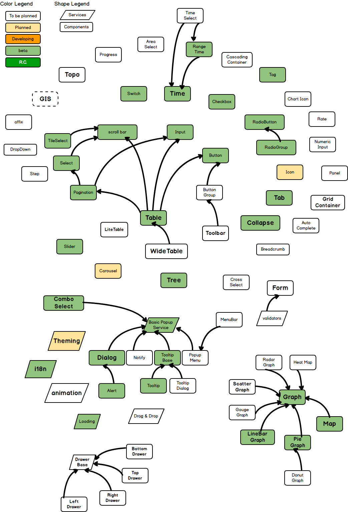

# Jigsaw

[](https://badge.fury.io/js/%40rdkmaster%2Fjigsaw)
[](https://travis-ci.org/rdkmaster/jigsaw)


## 名字的内涵
Jigsaw原意是一种拼图游戏，游戏的过程和现代web页面开发过程很类似，游戏者按照既定的蓝图将杂乱的碎片组合成一幅图，我们使用这个名字正是为了让web页面开发者能够像玩Jigsaw游戏一样，边玩边开发你的页面。

**组合**是这套组件的灵魂，Jigsaw致力于将组合做到极致。

把若干组件按照一定的顺序排列、布局之后可以得到一个应用页面，这是通常意义上的组合，我们将这个层次的组合称归之为Level one。Level one 的组合把组件当做原子，不可再拆分。

Jigsaw的组件不再是原子，它对组件的功能进行了二次抽象，同时，允许组件的局部高度定制化，甚至有的组件做到完全的可定制化。这里提到的定制化，换句话说，就是另一种形式的组合。小到类似`rdk-button`这样的基础组件，大到`rdk-table`这样的巨无霸组件，你看到的几乎每个UI元素，都是可以与其他组件再组合来覆盖其默认行为。我们将这个层次的组合归为Level two。

原子组件是有限的，组合才能产生无限的可能，用Jigsaw，尽情释放你的想象力吧！


## 用法
1. 如果未安装nodejs，或者nodejs低于6.x.x，npm版本低于3.x.x，请先安装[nodejs](https://nodejs.org)。
2. 下载或者clone本工程代码，假设保存到了 d:\jigsaw
3. 下载依赖包，有两个可选方式
    1. 如果你有权限接入zte内部网络，推荐使用install.exe来部署环境。直接运行 `d:\jigsaw\install.exe` 即可。
    2. 否则，你只能使用下面脚本通过npm安装，由于国内奇葩的网络环境，可能会出现各种问题，请自行搜索解决吧。
```
cd d:\jigsaw
npm config set proxy=http://proxy.zte.com.cn:80 #如果当前处于直连网络，则不可执行这个命令
npm config set registry=https://registry.npm.taobao.org/
npm config set sass_binary_site https://npm.taobao.org/mirrors/node-sass/
npm install -g @angular/cli #可选，推荐将angular-cli装为全局命令
npm install
npm start
```

4. 浏览器里打开 http://localhost:4200 正常的话就能看到测试页面了，这表示你的开发环境搭建完毕。

5. 后续直接在 `d:\jigsaw` 目录下运行 `npm start` 命令就可以启动开发环境了。我们推荐使用[WebStorm](https://www.jetbrains.com/webstorm/)作为IDE，Jigsaw专门针对这类IDE做了代码优化，让这些IDE可以精确提示更多的信息，节约你翻阅api文档的时间。

## 求星星！
请随手在 github 的工程上[赏个星星](https://github.com/rdkmaster/jigsaw)，这是对我们最好的鼓励！

## 组件状态图


## 参与贡献
- 建议优先处理没有打 `suspend` 标签的issue。所有的MR我们都会认真处理。
- 我们的研发流程主要是在中兴内网进行，但是github上的issue和PR我们也时刻在关注。
