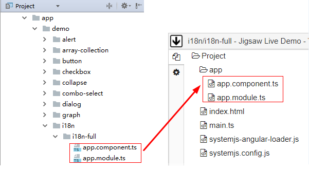

# 十分钟正则表达式实战，我们来用代码生成代码吧
很多人可能会被这个标题迷惑，所以，写在前面，这篇文章和AI一点关系都没有。我们玩的只是一个老掉牙的技术：正则表达式。当然这个文章也不是正则表达式的入门，网上有大把的入门文章可以看，我们这里谈的是正则表达式的实战。所以如果你对正则有一定基础的，推荐你仔细阅读，这个文章不会让你失望的。

## 辣么从哪开始呢？
这事要从这篇文章说起[《你所不知道的plunker用法 —— 分享Jigsaw七巧板的 Live Demo 解决方案》](...)，文章的最后提到我们实现了一个小工具用于将Jigsaw主工程中的demo代码转为可独立运行的plunker代码，我们今天就来看看这个工具是如何做到的。具体实现过程和Jigsaw工程耦合太重，没必要展开，我们主要关注这个工具的正则表达式部分。没错，我们要做的，就是拿正则表达式来解析TypeScript源码，并将这些代码硬生生转为其他形态的代码。

## 先看看我们到底要做啥
看图说话



图的左边是原始的demo代码，我们的目的是要转为右边的代码。

> 骗子！不就把文件拷贝过去就行了吗？

好吧，在开始实现这个工具之前，我也是这么像的。


要做的事情实际上比你想的要多的多，罗列如下
- 修复 `templateUrl` 的值
- 修复 `styleUrls` 的值
- 修复Jigsaw的import
- 找出 `mock-data`
- 修复 `app.component.ts`
- 修复 `app.module.ts`
- 其他。由于我们这个文章只关注正则，所以和正则无关的事情，都归到这里啦。

下面就一个个来把。

## 修复 `templateUrl` 的值
这是最简单的一部分。

这个事情是为了解决systemjs在解析组件的模板url的时候，url不是 `./` 开头就会出错的问题。

> systemjs的逻辑好神奇不是吗？


把这样的一行代码

```
@Component({
    templateUrl: 'app.component.html'
})
```

转为

```
@Component({
    templateUrl: './app.component.html'
})
```

> 这对多数正则表达式已经入门的同学来说，简直是在侮辱他们的智商。

不过，这里头坑还是有的。分分中我们就把正则写好了：

```
/\btemplateUrl\s*:\s*['"]\s*(.*)\s*['"]/g
```

匹配了一个关键字 `templateUrl`，前后还考虑了空格等因素，把url的值捕获出来：`(.*)`，除了对前后单双引号的匹配还需要改进外，其他的部分堪称完美。试一下下面的代码：

`templateUrl: 'app.component.html'` 毫无意外的被转为了 `templateUrl: './app.component.html'`。

沾沾自喜了？别急，试一下这个

```
@Component({
    templateUrl: 'app.component.html', selector: 'jigsaw-app'
})
```

替换后的结果是 `"app.component.html', selector: 'jigsaw-app"`，注意前后的双引号。由于我们偷懒没有捕获url的引号，所以无论是单引号还是双引号，都一律改为双引号，从而导致的这个结果。

问题出在我们捕获url值的 `(.*)` 这部分上了，熟悉正则的同学估计一眼就看出来问题出在 `*` 默认是贪婪的。我们预期只想捕获 `app.component.html` 这个串，但是由于 `*` 的贪婪，它捕获到了 `app.component.html', selector: 'jigsaw-app` 这个串了。问题的解决非常简单，只要让 `*` 不贪婪就好，改为 `(.*?)`。

总结：深刻理解正则的贪婪模式和非贪婪模式是你从正则走向正则高手的第一个坎。

## 修复 `styleUrls` 的值
这个修复的目的和 `templateUrl` 是一样的，都是要把url前面加是 `./`：

```
@Component({
    styleUrls: [
        'style1.css',
        'style2.css',
        'style3.css'
    ]
})
```

转为

```
@Component({
    styleUrls: [
        './style1.css',
        './style2.css',
        './style3.css'
    ]
})
```

**这里会用到另外一个技巧：如何匹配多行**


