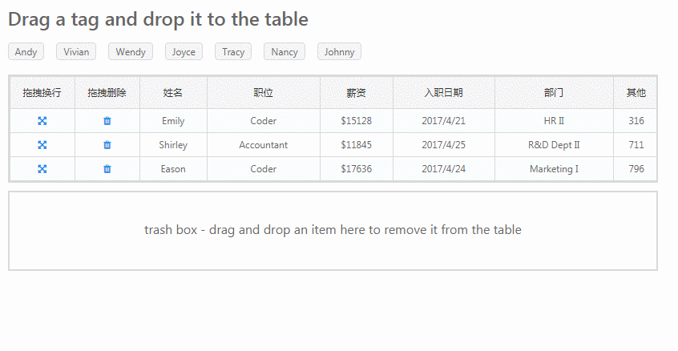
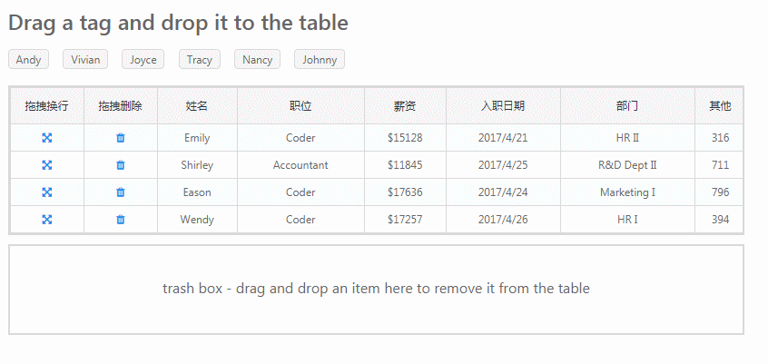
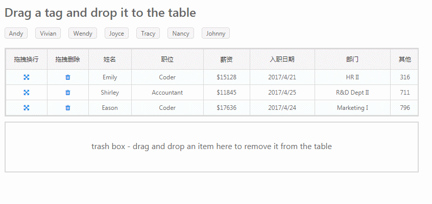

#h5的drag&drop简介

## 概念
- drag target(拖拽元素) 被拖动的元素
- drop target(拖放目标) 被放入的元素

## DragEvent
   
### 拖动元素涉及到的事件
- `dragstart` 开始拖拽
- `drag` 拖拽中
- `dragend` 结束拖拽
- `dragexit` 当拖拽目标不再是当前元素时触发
  
### 拖放目标涉及到的事件
- `dragenter` 拖拽进入拖放目标
- `dragover` 拖拽位于拖放目标之上
- `dragleave` 拖拽离开拖放目标
- `drop` 拖拽元素在拖放目标中被放下

## DataTransfer对象
在拖放操作中被保存的拖放数据

### 属性
- `effectAllowed: string` 拖拽对象赋予的拖放行为
- `dropEffect: string` 拖放目标接受的拖放行为

注: 这里的拖放行为只有三种'move'、'copy'、'link',用户是不可以自定义的

#### effectAllowed可能的值
- copy: 复制到新的位置.
- move: 移动到新的位置 .
- link: 建立一个源位置到新位置的链接.
- copyLink: 允许复制或者链接.
- copyMove: 允许复制或者移动.
- linkMove: 允许链接或者移动.
- all: 允许所有的操作.
- none: 禁止所有操作.
- uninitialized: 缺省值（默认值）, 相当于 all.

#### dropEffect可能的值
- copy: 复制到新的位置
- move: 移动到新的位置
- link: 建立一个源位置到新位置的链接
- none: 禁止放置（禁止任何操作）

### 方法
- `setData(format: string, data: string): boolean`
- `getData(format: string): string`
- `clearData(format?: string): boolean`
- `setDragImage(image: Element, x: number, y: number): void`

#### setData
一般在`dragstart`的时候设置需要传递的数据

参数:
- `format` 一般是'text'或者'url',
- `data` 需要注意的是data参数也是字符串类型的,如果想传递一个对象需要用`JSON.stringify`
```javascript
dragNode.addEventListener("dragstart", function( event ) {
    event.dataTransfer.setData('text', JSON.stringify(obj));
});
```

#### getData
一般在`drop`里获取传递的数据

如果数据是个对象,前面设置数据时转成了json字符串,这边需要解析
```javascript
dropNode.addEventListener("drop", function( event ) {
    const data = JSON.parse(event.dataTransfer.getData('text'));
});
```

#### clearData
一般在`dragend`里面清除数据
```javascript
dragNode.addEventListener("dragend", function( event ) {
    event.dataTransfer.clearData("text");
});
```

#### setDragImage
自定义一个期望的拖动时的图片。默认情况下,被拖动的节点创建成默认图片。
```javascript
dragNode.addEventListener("dragstart", function( event ) {
    event.dataTransfer.setDragImage(event.target, 0, 0);
});
```

## 实现拖拽和拖放动作

### 如何让一个元素可拖拽
在元素上添加属性 `draggable="true"`

### 一个页面有多种拖拽行为,比如增加,移动,删除等
可以给每个拖拽行为设置不同的`effectAllowed`,但最多只能设置三种,'move'、'copy'、'link',
可以不用管这三种拖拽行为的字面意思,仅作区分用。然后在拖放目标的dragenter和dragover事件
中设置`dropEffect`,把它设置成对应类型,这样就能区分不同的拖拽了。
```javascript
dragNode.addEventListener("dragstart", function( event ) {
    event.dataTransfer.effectAllowed = 'copy';
});

dropNode.addEventListener("dragenter", function( event ) {
    event.dataTransfer.dropEffect = 'copy';
});
dropNode.addEventListener("dragover", function( event ) {
    event.dataTransfer.dropEffect = 'copy';
});
```




### 拖入高亮效果
拖放目标的dragover和dragleave，可以模拟鼠标的hover行为
```javascript
dropNode.addEventListener("dragover", function( event ) {
    event.target.style.borderColor = '#108ee9';
});
dropNode.addEventListener("dragleave", function( event ) {
    event.target.style.borderColor = '#d9d9d9';
});
```



##demo地址
jigsaw项目(<https://github.com/rdkmaster/jigsaw>)里面启动服务,浏览器输入
`http://localhost:4200/dragdrop/table-drag`
