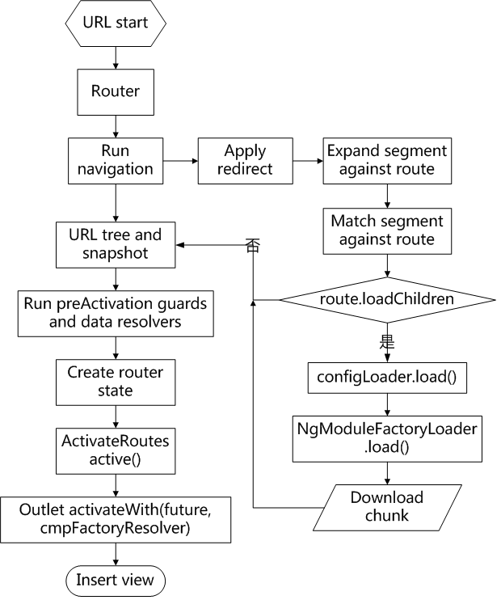
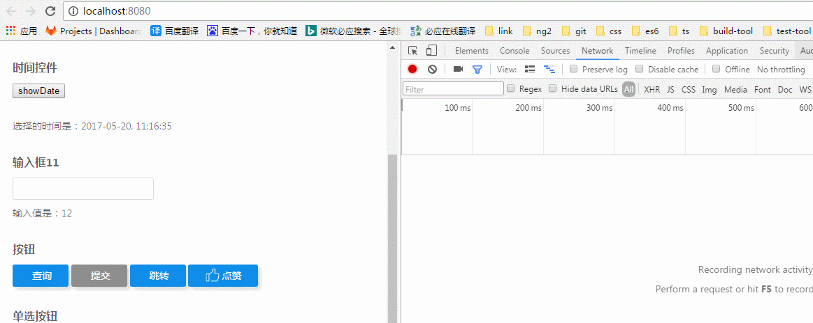

# Angular 路由的懒加载是如何实现的

Angular的路由功能是目前三大主流框架AVR中最强大的（没有之一），包含了多层嵌套路由、路由守护、路由模块懒加载等神奇的功能，完全能够满足各种复杂度的SPA需求了。我们来扒开这个强大功能的神秘面纱，今天就从路由懒加载开始。

## 在angular项目中配置懒加载路由

下面是一个典型的使用懒加载的配置方式：

1. AppModule中引入带`loadChildren`的路由。`loadChildren`是一切的关键，如果写成component了，那就没有效果了：
```
const appRoutes = [
    {
        path: 'button',
        loadChildren: './button/demo.module#ButtonDemoModule'
    }
];

@NgModule({
    declarations: [AppComponent],
    imports: [
        RouterModule.forRoot(appRoutes)
    ],
    bootstrap: [AppComponent]
})
export class AppModule {
}
```

2. 在ButtonDemoModule中配置路由导航，下面的配置平淡无奇，写出来只是为了给大家一个上下文而已，关键部分在上面的`loadChildren`！
```
const buttonDemoRoutes = [
    {
        path: 'basic', component: ButtonBasicDemoComponent
    }
];

@NgModule({
    declarations: [ButtonBasicDemoComponent],
    imports: [
        RouterModule.forChild(buttonDemoRoutes)
    ]
})
export class ButtonDemoModule {
}
```

这样的配置效果是，`/button` 这一层的路由是懒加载的，而 `/button/*` 这各级路由就是非懒加载的。这里是一个在线演示 <http://rdk.zte.com.cn/component/>，关键部分的源码在这里 <http://t.cn/RKV5jph>

_如果你喜欢Jigsaw组件库，请帮忙点个星星鼓励我们一下_

下面这个图是给懒人准备的：


## 路由懒加载在Angular里的处理流程

我们直接深入学习了 Angular 路由的代码，发现我们在路由模块中的配置，实际上是一个 `Route` 数组，路由组件会根据浏览器的url和这个数组，
找到这段路由的配置信息，包含对应的组件、路由插座、是否有守护、数据等信息。

路由懒加载的关键一步是：当 `Route` 数组中出现 `loadChildren` 配置信息时，路由模块会调用注入 `NgModuleFactoryLoader` 服务，发起请求下载对应的包文件，然后再执行路由的后续加载组件视图的操作。

这是大概的处理流程图：



## 路由懒加载究竟是如何实现的

一开始我们走了弯路，以为是路由模块实现的懒加载，但是在路由的实现代码中，死活找不到具体实现的方式，到后来才发现，这完全是webpack和angular-cli的功劳。

首先有一点非常重要：angular-cli是使用了webpack进行打包的，因此有必要先看看webpack是如何打包和懒加载的。

### webpack是如何打包和懒加载的
以webpack对js中引用了第三方插件的懒加载为例，在js代码中使用require.ensure，webpack可以通过require.ensure区分正常require进行切片。

```javascript
require.ensure([], (require) => {
    require("bootstrap/dist/css/bootstrap.min.css");
    require("eonasdan-bootstrap-datetimepicker/build/css/bootstrap-datetimepicker.min.css");
    require("eonasdan-bootstrap-datetimepicker");
}, 'datepicker'); // datepicker就是定义的切片包名
```

在webpack.config.js中配置切片名
```
output: {
    path: helpers.root('dist'),
    filename: '[name].[hash].js',
    chunkFilename: '[name].[hash].chunk.js' // 切片命名
}
```

webpack的切片结果：


实际的运行效果如下，可以看到datepicker.chunk.js文件是懒加载下来的
 


喜欢刨根问底的同学会问，webpack是如何懒加载切片文件的呢？我们可以扒开打包后的文件来看看。

webpack打包后生成的文件里有三个重要的全局函数

- `webpackJsonp`
- `__webpack_require__`
- `__webpack_require__.e`

下面逐个说明各自的作用。

### `webpackJsonp`

webpack利用JSONP技术，先在浏览器定义好webpackJsonp这个函数，然后从后端下载用webpackJsonp进行封装的js，
浏览器获取这样的js文件就可以立即执行了。webpackJsonp的源码如下：

```javascript
(function(modules) {
    window["webpackJsonp"] = function webpackJsonpCallback(chunkIds, moreModules, executeModules) {
        // add "moreModules" to the modules object,
        // then flag all "chunkIds" as loaded and fire callback
        /*......*/
        for(moduleId in moreModules) {
            if(Object.prototype.hasOwnProperty.call(moreModules, moduleId)) {
                modules[moduleId] = moreModules[moduleId];
            }
        }
        /*......*/
    };
})([])  
```
webpackJsonp有三个参数

- chunkIds 是包文件的标识；
- moreModules 是包文件自带的
modules，与moduleId一一对应，webpackJsonp会把包文件的modules复制到全局的modules；
- executeModules 是要立即执行的模块；

webpack打包出来的文件都是用webpackJsonp这个函数封装起来的，类似于：
```javascript
webpackJsonp([12, 33],{
    111:
    (function(module, exports) {
        /*......*/
    }),
    
    112:
    (function(module, exports, __webpack_require__) {
        /*......*/
    }),
    /*......*/
})
```

### `__webpack_require__`

主要根据moduleId从全局的modules加载模块。

### `__webpack_require__.e`

通过动态插入script标签的方式，下载对应的chunk包文件，可以看看源码
```javascript
__webpack_require__.e = function requireEnsure(chunkId) {
    /*......*/
    var head = document.getElementsByTagName('head')[0];
    var script = document.createElement('script');
    script.type = 'text/javascript';
    script.charset = 'utf-8';
    /*......*/
    script.src = __webpack_require__.p + "" + chunkId + ".chunk.js";
    /*......*/
    head.appendChild(script);
    return promise;
}
```

## angular-cli是如何打包的
angular-cli里面对webpack进行了定制化配置，不同于前面说的使用`require.ensure`进行切片打包，angular-cli
让webpack识别router里的`loadChildren`关键字进行打包。让我们来看看打包后的文件。

main.bundle.js
```javascript
var map = {
    "./button/demo.module": [
        919,
        11
    ],
    "app/demo/demo-list": [
        923,
        23
    ]
};
function webpackAsyncContext(req) {
    var ids = map[req]; if(!ids)
        return Promise.reject(new Error("Cannot find module '" + req + "'."));
    // __webpack_require__.e就是webpack用于懒加载的函数
    return __webpack_require__.e(ids[1]).then(function() {
        return __webpack_require__(ids[0]);
    });
};
```
可以看到webpack根据路由生成了一个url与数组ids对应的对象，url是用户在路由中配的loadChildren参数，ids[1]代表chunkId，也就是对应的包文件，
ids[0]代表moduleId，即需要加载的模块。在webpackAsyncContext这个函数中，`__webpack_require__.e` 通过chunkId从后端下载到chunk包文件，然后
`__webpack_require__` 通过moduleId加载到对应的模块。

button-demo-module对应的切片包 11.chunk.js
```javascript
webpackJsonp([11,32],{
    919: (function(module, __webpack_exports__, __webpack_require__) {
        /* harmony export (binding) */
        __webpack_require__.d(__webpack_exports__, "ButtonDemoModule", function() { return ButtonDemoModule; });
        var ButtonDemoModule = (function () {
            function ButtonDemoModule() {
            }
            return ButtonDemoModule;
        }());
    })
})
```

## 最终结论
用户浏览器输入如下url时

```
http://localhost:4200/button/basic
```

`RouterMoudule`会通过注入的 `NgModuleFactoryLoader`
调取angular-cli的 `webpackAsyncContext` 函数。`webpackAsyncContext` 通过map拿到对应的chunkId，调用 `__webpack_require__.e` 的动态下载对应的chunk包文件，下载完成后，就像使用普通模块一样，调用 `__webpack_require__` 执行对应的模块，于是在全局下就可以使用到这个模块了。

这个过程就是angilar-cli加载路由的 `loadChildren` 的过程。

## 题外话
看完了这个文章，我们发现Angular的代码和Angular-cli的关系是如此的紧（耦）密（合），所以请给我一个不使用angular-cli来初始化你的工程的理由！


