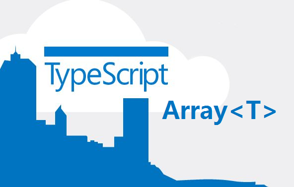

# 快速实现TypeScript的`Array<T>`接口



`Array<T>` 是ts中很常见的一个类型，大家往往以为它是一个普通类，实际上这是一个接口！今天我们来讨论一下为何要实现这个接口，以及用什么样的方法最快的去实现它。

## 背景
一切源于ts2.2到ts2.3之间的这个Breaking Change (<http://t.cn/RKLb9WS>)

下面简单介绍一下这个 Breaking Change。

> ES2015中，构造函数隐式的将所有对 `super.xxx()` 的调用，使用其实际对象替换掉 `this`，这主要是由于生成的构造函数代码需要捕获任何潜在的 `super.xxx()` 的返回值，并转为 `this.xxx()` 的返回值。因此需要调整 `Error`, `Array` 的原型链，这就导致了 `Error`, `Array` 等类的子类无法按照预期运行。受到这个波及的，不仅仅是TS的编译器，其他类似的编译器也有类似的问题。

简单的说，在ts2.2版本，应用代码是可以直接继承ts的Array<T>这样的內建对象的，到了ts2.3就不行了。

## 为何要实现 `Array<T>` 接口

这要从[Angular](https://angular.cn)的生命周期钩子和变化检查机制说起，这里就长话短说了。

> 笔者后续会再出一个文章详细讨论Angular的生命周期钩子和变化检查机制

一个组件是通过 `@Input()` 属性接收来自外部的数据的，如果数据数据是json对象、数组等复杂结构时，问题就来了。当该对象的某个属性发生了变化时，Angular的变化检测机制是发现不了的。

举例来说，传递了如下一个对象给一个组件：

```
const data = {
    prop1: 123
}
```

在组件外部执行了如下代码

```
data.prop1 = 456;
```

这样的情况，在组件内部是感知不到 `data.prop1` 属性发生了变化的。对Angular有一定了解的人相信对这个机制不陌生。

> 实际上是有办法可以感知到，但是非常消耗性能。

这一点让组件无法及时感知数据的变化并作出反应，造成组件的易用性下降。Angular官方给出了两种解决方案，但是 Jigsaw (<https://github.com/rdkmaster/jigsaw>) 开发团队认为都不好，所以 [Jigsaw](https://github.com/rdkmaster/jigsaw) 团队创造出了第三种方式。

> 这第三种方式的详情和本文主题关系不大，先不展开，后续笔者也会编写专门的文章说明

[Jigsaw](https://github.com/rdkmaster/jigsaw) 的处理变化的方式，需要对 `Array<T>` 这个內建类型做扩展，在把ts版本升级到2.3之后，发现了这个问题，于是 [Jigsaw](https://github.com/rdkmaster/jigsaw) 狠下决心，用了一个非常巧妙的方法自行实现了 `Array<T>` 接口。

## 如何实现 `Array<T>` 接口

`Array<T>` 接口中，一共有33个方法，保守估计需要大几千行代码才能实现，如果再考虑到bug和性能等因素，这几乎就是一个不可能完成的事情。笔者第一个想到的方法是去翻ts的源码，但是花了几乎一整个下午也没能找到ts源码中实现 `Array<T>` 接口的代码。。。

如果找不到办法扩展 `Array<T>` 接口，那Jigsaw的整个数据体系将要全部重新设计、重新实现。


在几近绝望的时候，笔者想到了js的`apply`函数的第一个参数，这个参数指明了当前这个函数的作用对象（即`this`），利用这个参数，我们就可以使出移花接木、隔山打牛的招数，巧妙的实现 `Array<T>` 接口。

下面以 `push()` 方法为例来说明实现的过程。我们需要的只是扩展 `Array<T>`，不需要改写 `Array<T>` 的原生方法的实现。也就是说，一个普通的数组对象的 `push()` 方法的实现完全能够满足我们实现  `Array<T>` 接口的需要。这点很重要。

我们要做的事情，就是如何把一个普通数组对象的 `push()` 方法作用到另外一个对象上，而不是作用到这个数组对象上。还记得我们前面刚刚提到的 `apply()` 方法的第一个参数吗？现在该是发挥它的作用的时候了。先上代码：

```
class JigsawArray<T> implements Array<T> {
    private _agent: T[] = [];
    public push(...items: T[]): number {
        return this._agent.push.apply(this, arguments);
    }
}
```

这几行代码是这篇文章最重要的部分，请务必读懂它。

- 第1行我们声明了一个叫 `JigsawArray` 的类，它华丽的实现了 `Array<T>` 接口；
- 第2行我们声明了一个普通数组，叫 `_agent`；
- 第3行我们实现了 `Array<T>` 接口的 `push()` 方法；
- 第4行是最最关键的一行代码。我们来将它解剖开来，看看是如何移花接木的。
    - `this._agent.push.apply()` 这部分代码很简单，字面上看，它通过 `apply()` 调用了普通数组对象 `_agent` 的 `push()` 方法。
    - 最关键在于 `apply()` 的第一个参数值是 `this`，这意味着 `push()` 方法是作用到了 `this` 上，而不是 `this._agent` 上！这带来的效果就是，`this._agent.push()` 直接对 `JigsawArray` 这类进行了操作，而 `this._agent` 并没有任何变化。这就是移花接木的效果了。

搞定了 `push()` 方法，其他的方法都按照类似的方式来，分分钟就把 `Array<T>` 接口实现好了，100出头行代码。但是，真的就结束了吗？

## “不听话”的`length`属性

`Array<T>` 接口中，有一个看起来很奇怪的语法：

```
[n: number]: T;
```

这是ts特有的语法，叫做 Index signature，中文翻译成啥我也不知道。加上这行表示当前类可以接收一个类型为数字的下标，这就是典型的数组操作了：

```
a[0] = 1;
const v = a[0];
```

坑爹的是这个 Index signature 不是一个普通的方法，因此无法被覆盖，这带来的一个问题是，应用在使用 `JigsawArray` 的下标做操作的时候，可能会导致 `length` 属性不对。示例代码如下：

```
const ja = new JigsawArray<number>();
ja.push(1, 2, 3);
console.log(ja.length); // 3, ok
ja[0] = 111;
console.log(ja.length); // 3, ok

// 使用超过当前长度的下标时，出错
ja[10] = 10;
console.log(ja.length); // 3, NOT GOOD
```

我们知道，对于一个普通数组，使用超过当前长度的下标时，它的length的值会自动增加到下标的值：

```
const a = [1, 2, 3];
console.log(a.length); // 3
a[10] = 10;
console.log(a.length); // 11
```

由于ts不允许我们覆盖 Index signature，所以这问题我们无法解决。


## 填 `length` 遗留的坑

前一小节的`length`问题如果留着不管，这就是一个坑，作为新时代有责任心的人，明知道有坑而不去填，那肯定说不过去！我们充分利用ts的语法，在这个 Index signature 前面加个readonly关键字，这样，应用在尝试使用下标修改 `JigsawArray` 的时候，编译器就报错！

```
Error:(60, 9) TS2542:Index signature in type 'JigsawArray<number>' only permits reading.
```

坑是填上了，但是我们也关上了数组下标操作这个大门，我们必须在别的地方开个窗户不是吗？于是，我们需要增加一对get/set方法，用于模拟下标操作：

```
public set(index: number, value: T): void {
    this._length = this._length > index ? this._length : index+1;
    this[index] = value;
}

public get(index: number): T {
    return this[index];
}
```

这样应用就可以通过get/set来完成下标的操作了，虽然不完美，但是功能上实现了，通过现代的IDE的提示功能，应用不需要查阅 `JigsawArray` 的 API 就可以猜到这对函数的作用。

我们满心欢喜的开始编译的时候，编译器报错了！

```
Index signature in type 'JigsawArray<T>' only permits reading.
```

这是为什么呢？原来，我们前面给 Index signature 设置了readonly了，还记得不？既然 Index signature 是只读的，那编译器这里报这个错是理所应当的！这个问题看起来又无解了，咋办？大风大浪都过来了，难道就在这个小阴沟了翻船吗？

我们来想办法欺骗一下ts编译器，先定义一个类

```
class ArrayHacker {
    public myself;
    constructor(arr: JigsawArray<any>) {
        this.myself = arr;
    }
}

```

这个类只有一个 `myself` 属性，其他啥事没做。然后在 `JigsawArray` 里声明一个这个类的成员变量：

```
private is = new ArrayHacker(this);
```

这样，就相当于把当前这 `JigsawArray` 实例传递给了 `ArrayHacker` 实例了，然后我们可以通过 `myself` 属性又访问到它。那么，这样啥用呢？别急，把 `set()` 改一下：

```
public set(index: number, value: T): void {
    this._length = this._length > index ? this._length : index+1;
    this.is.myself[index] = value;
}
```

唯一的区别是把原来的 `this[index]` 改成了 `this.is.myself[index]`，再编译一下，成功通过，看来，编译器真的被我们骗过去拉！


## 最后

我们终于巧妙的实现了 Array<T> 接口，完整的代码请直接访问Jigsaw的源码，直通车 <http://t.cn/RKU6szn>

## 和我们联系

关于这篇文章，如果有任何问题，欢迎通过RDK官方公众号和我们取得联系：

