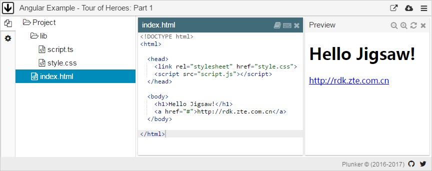
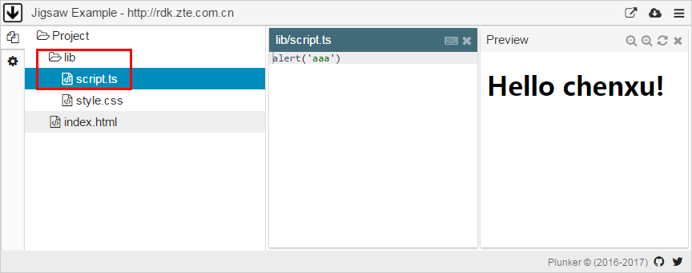

# 你所不知道的plunker用法 —— 分享Jigsaw七巧板的 Live Demo 解决方案


用 Angular 实现的页面，由于其对开发环境的要求比较高，这给Jigsaw七巧板 (<http://rdk.zte.com.cn>) 如何解决 Live Demo 带来了诸多的困难。本文主要介绍 plunker 的一个不为大众所知的用法，完美的解决了 Live Demo 的运行和维护。这个方法并非Jigsaw七巧板的原创，我们只是把过程详细记录下来。相信多数基于Angular的demo也会碰到类似困难，希望通过本文能够帮助到这些项目，让他们少走弯路。

## 背景
作为一个对完美有着孜孜不倦追求的开源项目，我们非常重视项目的文档质量，要求我们的文档读者能在不切换页面的情况下完成文档和demo的阅读，并且能够在页面上直接编辑demo并实时得到运行结果。要能够做到这样效果的工具并不多，plunker (<http://plnkr.co>) 是其中的一个。

## 弯路
为了达到目的，我们做了很多尝试，也走了很多弯路，我们先用很小的篇幅来盘点一下这些弯路。

### 自研一个替代品
由于你懂的原因，在中国大陆无法直接访问 <http://plnkr.co> ，这一度让我们非常沮丧。我们甚至想自己开发一个类似的工具，笔者花了2个小时做了一个MVP，基本上能达到目的。但是考虑到其维护成本，还是坚决的放弃了自研。现在想想，这个决定好明智。

### 自行部署一个plunker站点
可能有的同学还不知道，0.7.7版本之前的plunker是开源的，代码在这里 <https://github.com/filearts/plunker> 后来商业化了，作者就没再更新，截止到发稿时，它的版本号是1.2.0。

详细部署过程请查看[《如何部署一个你自己的plunker服务器》](https://mp.weixin.qq.com/s/gCQEFpXemVa-dDEcCVAbng)这篇文章。

我们在这个方向上，绕了个大弯。

有了代码，再在gist上找了篇非常简陋的文章，我们就开始了部署plunker之路。中国大陆访问npm网络的各种心酸就不提了，花了三四个工作日，终于弄好了。之后，又由于github认证在内网通不过的问题，折腾了有两天，我们自己实现了认证过程，总算是弄好了。

> 这个plunker基本上拥有plunker的所有功能，中国大陆可以通过这个url来访问 <http://rdk.zte.com.cn:8000/edit> 
>
> 我们会尽量让它在线，但我们的虚机资源很有限，在撑不住的时候，我们会考虑关闭它，也希望有热心人或者机构能够赞助性能更好的虚机来安顿这个plunker。

## 问题

自行部署了plunker后，我们就开始在它上面创建Jigsaw七巧板的 Live Demo 了。plunker的demo数据是保存在mongodb中的，这是最大的问题。在项目迭代频繁的时候，demo常常要一起对齐修改，保存在数据库中的demo代码非常难以维护。这让我们开始怀疑当前的方式是否需要做出改变？

此外，由于Jigsaw网站的特殊性导致 <http://rdk.zte.com.cn> 这个域名有内外网两台服务器。这就造成内外网的demo数据如何合并和同步的问题。

这两个问题均没有好办法解决。

## 解决
当前官网上的版本的plunker有个功能，直接把demo的数据按照特定的格式post给它，它就能够将这些demo代码像存在数据库中一样呈现出来，并可以编辑，立即生效。更重要的是，这部分功能不会被墙！这两点解决了我们前面碰到的所有问题。

想知道怎么做到吗？快往下看。

下面以这个简单的plunk代码为例说明如何做到：



### 表单
前文提到，需要把数据post给plunker服务器，这个最简单的方式就是用表单了：

```
<html>
 <head>
    <meta charset="utf-8">
 </head>
 <body>
  <form
    id="mainForm"
    method="post"
    action="https://embed.plnkr.co?show=preview"
    target="_self">
 </body>
</html>

```

注意action的值，别填错

```
https://embed.plnkr.co?show=preview
```

### 数据
下面来看看数据如何发送给服务器的。plunker接收一些文本作为一个文件，因此，我们定义一个input，把代码丢里头就好啦，非常简单：

```
<input type="hidden"
    name="entries[lib/script.ts][content]"
    value="alert('Hello Jigsaw, http://rdk.zte.com.cn')" />
```

关键部分是 `value`，它的值大家都不陌生，就是弹一个对话框。注意如果这个字符串如果包含 `< > "` 这几个字符，则需要转义一下——不知道如何转义的，请自行面壁三分钟然后自己google去。

`name` 的值很有意思，我们来仔细看看。

其中辣眼的是这部分 `lib/script.ts` 看起来像是一个路径。对！它就是一个路径，对应着运行效果的红框部分：



后面的 `content` 这个值的作用，继续往下看。

有没有考虑到编码的问题？对！如果 `value` 的值包含汉字，那就出问题了，所以我们需要告诉 plunker `value` 的编码，通过下面这一行


```
<input type="hidden"
    name="entries[lib/script.ts][encoding]"
    value="utf8" />
```

第一个值 `lib/script.ts` 保持不变，后面的变成了 `encoding` 了，而 `value` 的值也变成了编码了。

到这里，我们就定义好了一个demo中的文件的所有部分了，如下：

```
<input type="hidden"
    name="entries[lib/script.ts][content]"
    value="alert('Hello Jigsaw, http://rdk.zte.com.cn')" />
<input type="hidden"
    name="entries[lib/script.ts][encoding]"
    value="utf8" />
```

接下来就简单了，你有多少个文件，就加多少行呗。

最后，还需要增加一些额外的信息：

```
<input type="hidden" name="tags[0]" value="angular" />
<input type="hidden" name="tags[1]" value="Jigsaw" />
<input type="hidden" name="tags[2]" value="tutorial" />
<input type="hidden" name="title" value="Jigsaw Example - http://rdk.zte.com.cn" />
<input type="hidden" name="source[type]" value="Jigsaw Example" />
<input type="hidden" name="source[url]" value="http://rdk.zte.com.cn" />
```

- `tag` 这个demo的标签，是SEO的一部分。
- `title` 是demo的标题，给起个好名字吧，我喜欢Jigsaw七巧板这个名字。github上搜一搜，帮忙点个星星哦。
- `source` 额外的描述信息。

这样，就搞好了一个最简单的 plunker demo 了！不对，好像还差一点。我们还没让form提交对吧。简单，增加如下一行

```
<script>document.getElementById("mainForm").submit();</script>
```

这样就在这个页面下载好了后，直接提交form的内容给plunker了。赶紧试一下吧。

完成后的页面完整代码如下：

```
<html>
 <head>
  <meta charset="utf-8">
 </head>
 <body>
  <form id="mainForm" method="post" action="https://embed.plnkr.co?show=preview" target="_self">
    <input type="hidden" name="entries[lib/script.ts][content]" value="alert('Hello Jigsaw, http://rdk.zte.com.cn')" />
    <input type="hidden" name="entries[lib/script.ts][encoding]" value="utf8" />

    <input type="hidden" name="entries[lib/style.css][content]" value="/* Add your styles here */" />
    <input type="hidden" name="entries[lib/style.css][encoding]" value="utf8" />

    <input type="hidden" name="entries[index.html][content]" value="&lt;!doctype html&gt;

&lt;html&gt;
  &lt;head&gt;
    &lt;link rel=&quot;stylesheet&quot; href=&quot;lib/style.css&quot;&gt;
    &lt;script src=&quot;lib/script.js&quot;&gt;&lt;/script&gt;
  &lt;/head&gt;

  &lt;body&gt;
    &lt;h1&gt;Hello Jigsaw!&lt;/h1&gt;
    &lt;a href=&quot;http://rdk.zte.com.cn&quot;&gt;http://rdk.zte.com.cn&lt;/a&gt;
  &lt;/body&gt;
&lt;/html&gt;
" />
    <input type="hidden" name="entries[index.html][encoding]" value="utf8" />

    <input type="hidden" name="tags[0]" value="angular" />
    <input type="hidden" name="tags[1]" value="Jigsaw" />
    <input type="hidden" name="tags[2]" value="tutorial" />
    <input type="hidden" name="title" value="Jigsaw Example - http://rdk.zte.com.cn" />
    <input type="hidden" name="source[type]" value="Jigsaw Example" />
    <input type="hidden" name="source[url]" value="http://rdk.zte.com.cn" />
  </form>
  <script>document.getElementById("mainForm").submit();</script>
 </body>
</html>
```

## 后续
还没完！前面我们才仅仅知道如何把数据提交给plunker显示出来而已，我们的终极目标是
- IDE在refactoring的时候，能够顺便把demo相关的代码也一起改正；
- Live Demo 能保证在最新的代码下运行，这个问题在类似Jigsaw这样的发布npm包的项目下才有；
- 完全自动化生成 plunker demo 的页面；

解决这个问题的关键是：
- 将demo与主工程集成在一起，这样IDE从能够管理到这些demo；
- 写个小工具，自动将主工程上的demo转换为前文的那个表单页面。这部分与Jigsaw的实现耦合比较紧，就不详细写出来了。这个是Jigsaw这个工具的地址 <http://t.cn/RKkXkIe>，感兴趣的可以看看源码，使用nodejs运行。

## 题外话

这些文章都是我们在研发Jigsaw七巧板过程中的技术总结，如果你喜欢这个文章，请帮忙到 Jigsaw七巧板 (<https://github.com/rdkmaster/jigsaw>)的工程上点个星星鼓励我们一下，这样我们会更有动力写出类似高质量的文章。Jigsaw七巧板现在处于起步阶段，非常需要各位的呵护。