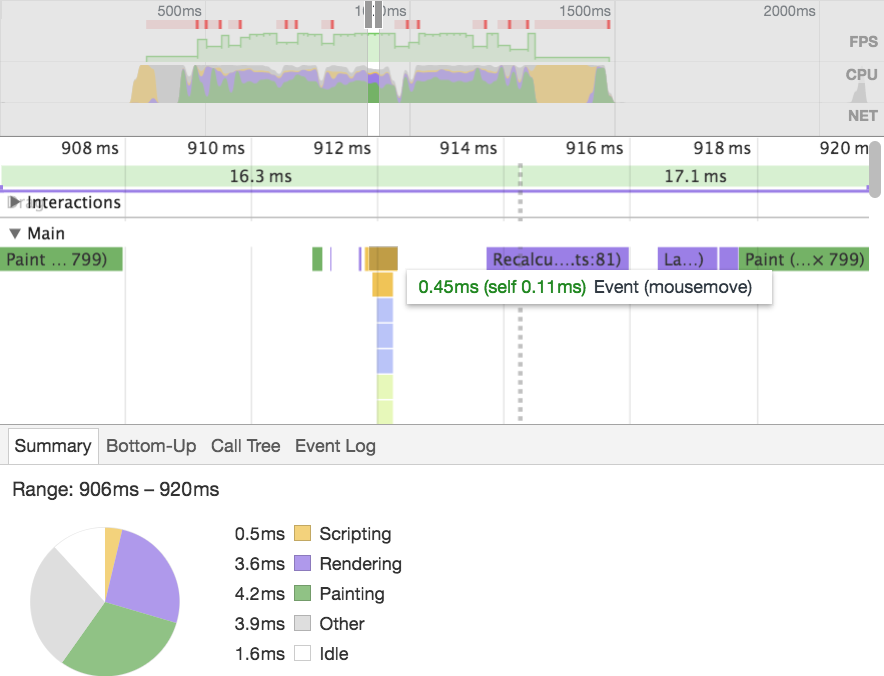

# 译文 | 在Angular中使用zone来提升性能

 
> 关于原作者 Pascal Precht，他是一名资深前端狗，同时也是Google提名的Angular专家开发者。他作为Angular的贡献者，创作了angular翻译模块。同时他也是Angular文档团队的一员。
>
> 这篇文章创作与2017年2月21日，于2017年8月5日被_陈旭@中兴RDK_翻译。原文地址是 <https://blog.thoughtram.io/angular/2017/02/21/using-zones-in-angular-for-better-performance.html>
> 
> 译者：这是学习 Angular zone 的好文章，它揭开了神秘的zone，让我们对Angular的变化检测机制有了更加深刻的理解。Zone是Angular变化检测机制的基石，没有zone就没有变化检测机制。

在我们最近的一些文章中，我们讨论到了如何利用Angular的`ChangeDetectionStrategy` API和脱离变化检测器的小技巧等等，来让Angular应用运行的更快[1]。虽然我们提及了很多不同的方法来改进demo应用的性能，但是并不是所以的可能性都被提及。

Jordi Corllell提出了另一个方法，利用zone API来让我们的代码执行在Angular zone之外，这让Angular停止进行不必要的变化检测，他甚至花了时间和精力创建了一个plunk demo，用于演示这是如何做到的。

**我们必须要对他的工作道声谢谢**，并好好思考一下他文章中提及的解决方案。所以写这篇文章就是为了看看他写的这个demo，并解释他是如何利用zone来让这个demo应用以接近60fps（帧每秒）的效率运行的。

## 主要内容
- 实际看看这个demo
- zone的概念
- 让代码在Angular zone以外运行
- 测算性能
- 结论

## 实际看看这个demo
在我们开始阅读代码之前，我们先看看这个demo的运行效果。快速介绍一下这个demo：demo创建了一万个可拖拽的svg框，主要挑战来自如何让拖拽某个框过程尽可能的平滑，而非创建这一万个框的过程。换句话说，我们的目标是实现60fps的平滑拖拽体验，考虑到在鼠标移动过程中频繁发出的事件，在默认情况下会导致Angular不停的对这一万个框进行重新渲染，这可能的确是一个挑战。

- 这是一个优化前的实现：<https://embed.plnkr.co/UBI5Sc5eDMpkDDkJfeGX>
- 这是Jordi利用Angular的zone API 优化后的版本：<https://embed.plnkr.co/GIf9sPuuZRLKwYK7mTfr>


注意两个demo的差异并不是特别容易察觉，优化后的版本的js每一帧的运行性能明显提升了。在给出具体的性能数据之前，我们先来快速了解一下zone，以及来看看demo的代码，并讨论一下Jordi是如何利用Angular的`NgZone`这个API让demo达到这样的性能的。

> 译者：原文的用词很容易给人造成误解。作者说的_不易察觉_是指demo表现上不容易被察觉，实际上只要你拖拽两个demo上的框框就会明显感觉到差距了。

## zone的概念
在我们开始使用Angular的`NgZone`这个zone API之前，我们需要先搞清楚zone到底是啥东西，以及为哈它在Angular里很有用。在这个方面我们不会太过深入，因为在这之前，我已经写了这两篇文章了：

- 理解zone[2]：讨论了普通情况下的zone的概念，以及它在分析异步代码执行方面的用途；
- Angular中的zone：讨论了Angular是如何利用zone的API创建了`NgZone`，`NgZone`让Angular自身以及Angular使用者的代码在zone内外运行。

如果你还没阅读过这两个文章，我们隆重推荐你阅读一下他们，他们会让你对zone是啥以及它能够做啥有一个坚实的理解。简单的说，zone对浏览器的异步API做了封装，并对外发出异步任务何时开始何时结束的通知。Angular利用了这一点，从而获得异步任务执行结束的通知。异步任务包括了`xhr`调用，`setTimeout()`，以及各种各样的用户事件，例如 `click`, `submit`, `mousedown`...

因为任何的异步任务都可能导致应用状态的变化，Angular在得到异步任务结束的通知之后，就知道它应该执行变化检测了。我们在使用`Http`服务从远程服务器上取到数据就是一个典型的例子，下面的代码片段演示了这样的一个调用是如何改变应用的状态的：

```
@Component(...)
export class AppComponent {

  data: any; // initial application state

  constructor(private dataService: DataService) {}

  ngOnInit() {
    this.dataService.fetchDataFromRemoteService().subscribe(data => {
      this.data = data // application state has changed, change detection needs to run now
    });
  }
}
```

有趣的是，作为开发者，我们不需要通知Angular何时该进行变化检测，zone会替我们告诉Angular的，这是因为Angular注册了相应的回调了。

既然说到这了，我们就来看看如何利用这个特性帮助我们提升应用的性能。

## 让代码在Angular zone以外运行
我们已经知道了，在任何的异步任务结束之后，Angular都会进行变化检测，这就是我们优化前的demo运行的很慢的原因，我们先看看`AppComponent`的模板

```
@Component({
  ...
  template: `
    <svg (mousedown)="mouseDown($event)"
         (mouseup)="mouseUp($event)"
         (mousemove)="mouseMove($event)">

      <svg:g box *ngFor="let box of boxes" [box]="box">
      </svg:g>

    </svg>
  `
})
class AppComponent {
  ...
}
```

有3个事件被绑定在了svg元素上，任何一个事件的回调函数执行完了后，Angular的变化检测会开始执行。这就是说，即使我们没有拖拽一个框框，而是仅仅在他们上面移动鼠标，Angular也会进行变化检测！

这就是`NgZone` API可以派上用场的地方了，`NgZone`让我们可以精确控制哪些应该在Angular的zone以外运行，以达到避免触发不必要的变化检测。事件的回调函数依然会被调用，但是他们不是在Angular的zone中被调用的，因此在这些函数执行完毕后，Angular不会收到任何通知，因此它也就不会执行变化检测了。我们只需要在拖拽完成后松开鼠标的那一瞬间进行变化检测就行了。

我们如何做的到呢？在《Angular中的zone》[3]一文中，我们已经讨论了如何使用`NgZone.runOutsideAngular()`来让我们的代码运行在Angular的zone之外了，我们这里需要做的事情就是确保`mouseMove()`方法运行zone之外就好了。并且我们也知道，我们需要在一个框框在开始被拖拽之前才注册相应的事件回调函数。换句话说，我们不能在模板中注册这个事件的回调函数，而必须采用命令的方式来完成事件的注册。

代码看起来是这样的

```
import { Component, NgZone } from '@angular/core';

@Component(...)
export class AppComponent {
  ...
  element: HTMLElement;

  constructor(private zone: NgZone) {}

  mouseDown(event) {
    ...
    this.element = event.target;

    this.zone.runOutsideAngular(() => {
      window.document.addEventListener('mousemove', this.mouseMove.bind(this));
    });
  }

  mouseMove(event) {
    event.preventDefault();
    this.element.setAttribute('x', event.clientX + this.clientX + 'px');
    this.element.setAttribute('y', event.clientX + this.clientY + 'px');
  }
}
```

我们注入了`NgZone`，并在`mouseDown()`这个回调函数中调用了`runOutsideAngular()`方法，我们在这个方法中监听了`mousemove`事件，这确保了`mousemove`事件的回调函数的确是在我们开始拖拽框框的时候才被注册到dom上了。同时，我们保留被选择的框框的dom元素，这样我们才可以在`mouseMove()`中更新框框的`x`和`y`属性。注意到我们是直接对框框的dom元素进行操作的，而不是修改框框的数据对象通过绑定方式实现的拖拽效果，这是因为在zone外面，我们无法触发变化检测，绑定也就失效了。换句话说，我们**确实**更新了dom元素了，因此我们可以看到框框在移动，但是移动过程中，我们并未对框框的数据做出修改。

并且，要注意我们还把`mouseMove()`回调函数从组件的模板中删除了。我们还可以将`mouseUp()`回调函数也像`mouseMove()`一样，从模板中删除，并以代码的方式实现绑定，但是这样做并不能带来实质性的性能提升，因此我们还是将它保留在了模板中，以让实现变得简单一些：

```
<svg (mousedown)="mouseDown($event)"
      (mouseup)="mouseUp($event)">

  <svg:g box *ngFor="let box of boxes" [box]="box">
  </svg:g>

</svg>
```

下一步，我们需要确保在鼠标松开（`mouseUp`）的时候，我们能够正确更新框框对应的位置数据，并且，我们希望立即进行变化检测来让视图和数据模型恢复同步。`NgZone`一个很酷的功能是，它不仅能够让我们的代码运行在Angular zone的外头，还能够让代码继续回到Angular的zone中执行，这最终会再次触发Angular的变化检测。我们需要做的就是调用`NgZone.run()`，把需要执行的代码传递给它。

这是我们的`mouseUp()`的代码：

```
@Component(...)
export class AppComponent {
  ...
  mouseUp(event) {
    // Run this code inside Angular's Zone and perform change detection
    this.zone.run(() => {
      this.updateBox(this.currentId, event.clientX + this.offsetX, event.clientY + this.offsetY);
      this.currentId = null;
    });

    window.document.removeEventListener('mousemove', this.mouseMove);
  }
}
```

需要注意，我们在**每一次的**`mouseUp`中都会删除`mousemove`事件的回调函数，否则在鼠标移动的过程，它的回调函数就会继续执行，这会造成即使鼠标已经被释放，但是框框却仍然跟着鼠标移动的问题，从而让我们的拖拽功能失效。进一步的，我们要尽可能的把事件回调函数聚集在一起，否则不仅会造成一些奇怪的副作用，还会消耗内存。

## 测算性能
既然我们已经知道了Jordi是如何实现这个demo的了，我们再来看看一些技术数据吧。下图的数据是我们在相同的电脑上通过相同的统计方式得到的。统计方法可以参考我们之前关于性能的文章[4]



## 结论
可以使用zone来避开Angular的变化检测，这个方法不会导致变化检测器离线，也不会导致应用代码变复杂。实际上，这说明zone的API非常容易使用的，特别是使用Angular的`NgZone`的API来让代码运行在zone之内和zone之外也非常简单。基于前面的统计数据，我们可以认为这个方法是我们所有相关文章所使用的各种方法中性能最好的。使用zone的API的开发体验比其他文章中介绍的方法也要更好，因为这个方法比起手工使变化检测器离线要更容易实现。这无疑是迄今为止我们对性能改进方面最优雅的方法了。

尽管如此，我们要注意到这个方法带来了一些（可修复的）负面影响。例如，我们使用了dom的API，以及全局`window`对象，这都是我们应该尽力避免的。如果我们需要使用服务端渲染（SSR）这些代码，直接引用`window`对象会导致一些问题，我们后续将会针对这些特定的SSR问题进行讨论。然而这个demo就目前而言，这不是一个大问题。

我们再次对Jordi Collell[5]给这个demo的改进提出的这个方法表示感谢。

（原文全文完）

## Jigsaw七巧板在这方面的实践
> 注意这里的第一人称“我”或者“我们”均指Jigsaw七巧板开发团队，而非前文中的作者。

我们在实现Jigsaw七巧板的`jigsawMovable`指令过程中，也使用到了这个技巧。并且我们的实践避开了作者在“结论”小节提及的那个负面影响。`jigsawMovable`指令主要是用在对具有浮动特性的组件做拖拽改变位置的场景，一个非常典型的应用场景是弹出式对话框拖拽标题改变位置。

我们来快速的过一下这个功能，以增加读者对zone的理解。

在用户鼠标按下对话框的标题的时候，下面的回调函数被执行：

```
private _dragStart = (event) => {
    event.preventDefault();
    event.stopPropagation();
    this._position = [event.clientX - AffixUtils.offset(this._movableTarget).left,
        event.clientY - AffixUtils.offset(this._movableTarget).top];
    this._moving = true;

    if (this._removeWindowMouseMoveListener) {
        this._removeWindowMouseMoveListener();
    }
    this._zone.runOutsideAngular(() => {
        this._removeWindowMouseMoveListener = this._renderer.listen(document, 'mousemove', this._dragMove);
    });

    if (this._removeWindowMouseUpListener) {
        this._removeWindowMouseUpListener();
    }
    this._removeWindowMouseUpListener = this._renderer.listen(document, 'mouseup', this._dragEnd);
};
```

注意看这3行

```
this._zone.runOutsideAngular(() => {
    this._removeWindowMouseMoveListener = this._renderer.listen(document, 'mousemove', this._dragMove);
});
```

我们把鼠标移动事件注册过程放在了zone外面，这样，鼠标移动过程，Angular就不会对下面的代码做任何变化检测了：

```
private _dragMove = (event) => {
    if (this._moving) {
        const ox = event.clientX - this._position[0];
        const oy = event.clientY - this._position[1];
        this._renderer.setStyle(this._movableTarget, 'left', ox + 'px');
        this._renderer.setStyle(this._movableTarget, 'top', oy + 'px');
    }
};
```

主要流程和本文前面部分介绍的基本上一样，我们主要看看Jigsaw七巧板的改进之处。注意到我们并没有使用`window`对象的API了吗？我使用的是一个非常Angular-friendly的方式：`this._renderer.setStyle()`。这样既利用了zone的强大功能，又避开了前文demo的缺陷。

下面给出几个在线demo，打开就可以看到效果
- <http://rdk.zte.com.cn/jigsaw/live-demo/dialog/misc/index.html>
- <http://rdk.zte.com.cn/jigsaw/live-demo/alert/popup/index.html>

`jigsawMovable`指令的完整代码可以在这里[6]找到。


## 题外话
这些文章是Jigsaw七巧板团队开发过程中碰到的难题的解决方法，或者是团队成员的学习成果。我相信这些文章对喜欢Angular，喜欢Jigsaw的人，都同样值得一读。欢迎以任何形式转发，但是请保留Jigsaw七巧板的签名和链接 <https://github.com/rdkmaster/jigsaw> 点击阅读原文可以帮助我们改进这篇文章。


## 附录
- [1] how to make our Angular apps fast: <https://blog.thoughtram.io/angular/2017/02/02/making-your-angular-app-fast.html>
- [2] Understanding Zones: <https://blog.thoughtram.io/angular/2016/01/22/understanding-zones.html>
- [3] Zones in Angular: <https://blog.thoughtram.io/angular/2016/02/01/zones-in-angular-2.html>
- [4] article on performance: <https://blog.thoughtram.io/angular/2017/02/02/making-your-angular-app-fast.html>
- [5] Jordi Collell: <https://twitter.com/galigan>
- [6] code of jigsawMovable: <https://github.com/rdkmaster/jigsaw/blob/master/src/jigsaw/directive/movable/movable.ts>